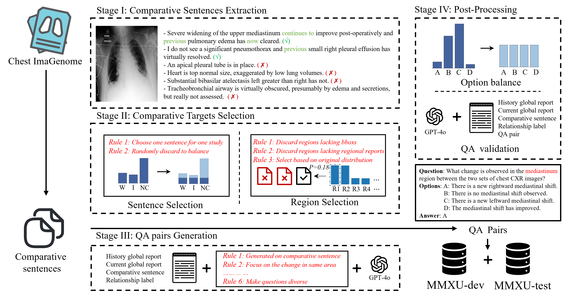
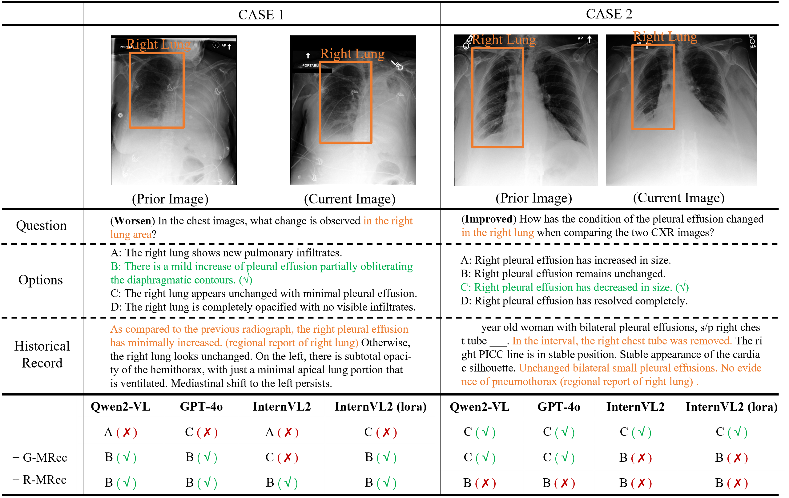

# MMXU benchmark
**MMXU** (Multimodal and MultiX-ray Understanding) is a novel dataset for MedVQA that focuses on identifying changes in specific regions between two patient visits. Unlike previous datasets that primarily address single-image questions, MMXU enables multi-image questions, incorporating both current and historical patient data. 

[](https://arxiv.org/pdf/2502.11651) [](https://huggingface.co/datasets/LinjieMu/MMXU)

## News

- (05/16/2025) Our [paper](https://arxiv.org/pdf/2502.11651) has been accepted by ACL 2025 Findings!
- (02/22/2025) The MMXU-test benchmark has been released, containing 3,000 multiple-choice questions on disease progression in chest X‑rays!
 
## Table of Contents
- [MMXU benchmark](#mmxu-benchmark)
  - [News](#news)
  - [Table of Contents](#table-of-contents)
- [Introduction](#introduction)
- [Usage](#usage)
- [Case Example](#case-example)
- [Citation](#citation)

# Introduction

In this paper, we introduce MMXU (Multimodal and MultiX-ray Understanding), leveraging the rich resources of patient electronic medical records (EMRs) from the MIMIC-CXR dataset. Unlike previous works, which focus solely on the current image or are restricted to simple questions, this benchmark is specifically designed to inquire about differences in specific regions between a patient’s two visits. MMXU contains two splits: *test* and *dev*. `MMXU-test` consists of 3,000 entries from 1,201 patients and 2,469 studies, while `MMXU-dev` contains 118K QA pairs involving 114K images. 



The figure outlines the pipeline for constructing MMXU. The process begins with the Chest ImaGenome dataset. The entire method comprises four distinct phases:

1. Comparative Sentence Extraction
2. Comparative Target Selection
3. QA Pair Generation
4. Post‑Processing

# Usage
* **File description**

  * `MMXU-test.jsonl`: the MMXU test split, containing 3 k examples.
  * `MMXU-dev.jsonl`: the MMXU development/training split, containing 118 k examples (to be released soon).

* **Images**

  * Please apply for and download the MIMIC‑CXR‑JPG dataset from [https://physionet.org/content/mimic-cxr-jpg/2.1.0/](https://physionet.org/content/mimic-cxr-jpg/2.1.0/).
  * After downloading, either create a symbolic link from this project’s `files` directory to the `files` directory of the MIMIC‑CXR‑JPG dataset, or adjust the image paths accordingly.


* **Report information**

  * Our dataset is built on the MIMIC‑CXR‑JPG dataset, which is a restricted‑access resource. This means we cannot release the associated report content elsewhere.
  * We will make the data containing fine‑grained report information available on [https://physionet.org](https://physionet.org) as soon as possible.

# Case Example



# Citation
If you use the `MMXU dataset` in your research, please cite the following paper:

```bibtex
@article{mu2025mmxu,
  title={MMXU: A Multi-Modal and Multi-X-ray Understanding Dataset for Disease Progression},
  author={Mu, Linjie and Huang, Zhongzhen and Qin, Shengqian and Zhu, Yakun and Zhang, Shaoting and Zhang, Xiaofan},
  journal={arXiv preprint arXiv:2502.11651},
  year={2025}
}
```